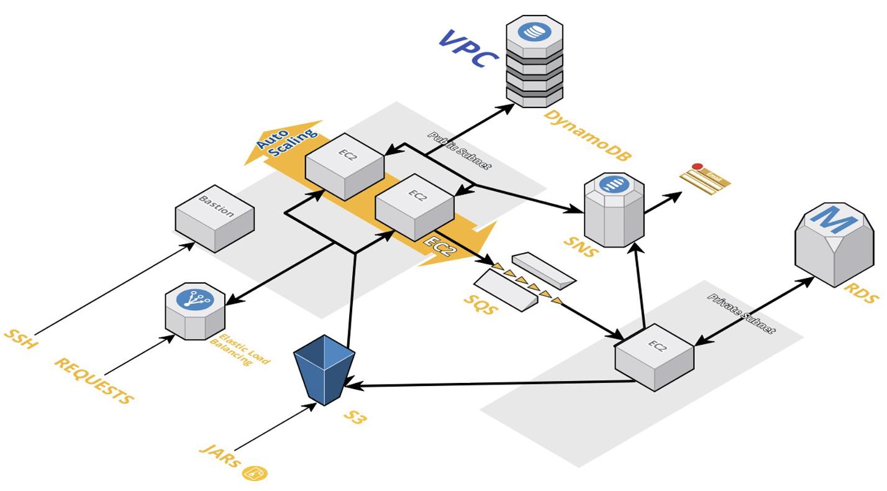

# Final Project requirements



---

### Tasks:

- Create a Terraform script which will generate and deploy next infrastructure:
  - VPC with four subnets (tw - public, tw - private).
  - ASG with minimum two EC2 instances (one EC2 instance per each public subnet). EC2 instances in public subnets should have SSH/HTTP/HTTPS access from all IPs.
  - NAT EC2 instance (aka Bastion) in public subnet.
  - EC2 instance in one of the private subnets. Private EC2 should have SSH access from public subnets only. Implement ability to download software from the internet using created NAT EC2 instance.
  - All EC2 instances (except of NAT EC2) both public/private should have java8 installed during instance creation.
  - DynamoDB database with next parameters (EC2 instances should have permissions to access DynamoDB table):
    - TableName: edu-lohika-training-aws-dynamodb
    - Field: UserName, type: String
  - Postgres RDS with next parameters (only private subnets should have access to the RDS instance) Please not that you need to create RDS instance in VPC (in private subnets).
    - DBName: EduLohikaTrainingAwsRds
    - Port: 5432
    - User/password: rootuser/rootuser
    - (you don’t need to define a schema; it will auto generating)
  - SNS topic with the next name – edu-lohika-training-aws-sns-topic
  - SQS queue with the next name – edu-lohika-training-aws-sqs-queue
  - LoadBalancer with 80 port targeting to public EC2 instances.
  - Health check for ELB: /actuator/health
  - Run into public subnet:
    - calc-2021-0.0.1-SNAPSHOT.jar
  - Run into private subnet:
    - persist3-2021-0.0.1-SNAPSHOT.jar
    - set environment variable RDS_HOST with correct RDS address
  - On your local machine, you need to have java 8.
  - On your local machine execute:
    - java -cp calc-client-1.0-SNAPSHOT-jar-with-dependencies.jar CalcClient <ELB’s DNS name>
  - docs folder for project JAR files

---

### How to run:

- Install Terraform
- Clone this repo
- Create a key in AWS IAM and add those to variables
- Run:

```
  terraform init
  terraform plan
  terraform apply -auto-approve
```

- For getting output values on demand:

```
terraform output {output_name}
```

- For connecting to your VM:

```
  ssh -i ~/.ssh/YourKeyName.pem ec2-user@YourMachinesPublicDns.com
```

- For connecting to your DB (RDS):

```
  psql -Upsql -U{USERNAME} -h{HOST_NAME} -d{DB_NAME}
```

- For checking SQS run:

```
  aws sqs send-message --queue-url {SQS URL} --message-body "Test message from SQS" --region us-west-2
  aws sqs receive-message --queue-url {SQS URL} --region us-west-2
```

- For checking SNS run:

```
  aws sns publish --topic {ARN of SNS topic} --message 'Hello world from AWS' --region us-west-2
```

- Once you're done, run:

```
  terraform destroy -auto-approve
```
